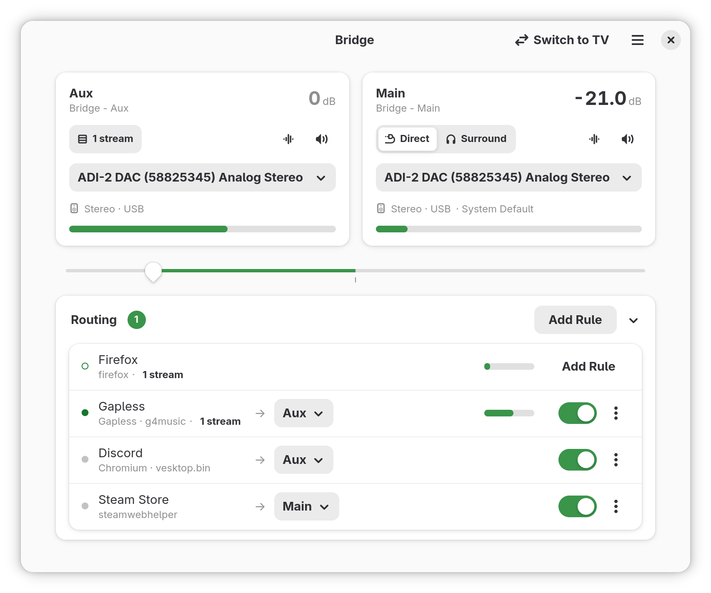

# Bridge

Route your apps to two virtual outputs and mix between them. Send chat to one side, 
your game to the other.



0.5.0 marks the initial beta release. Please use with caution.

## Features

Bridge creates two virtual outputs, Aux and Main, and at its center sits the
crossfade mixer. Route your audio to the separate outputs and adjust the mix
between them from anywhere.

- Create Routing Rules to automatically send app audio to your desired output
- Conveniently setup headphone virtual surround by providing your own HeSuVi HRIR file
- Create output presets and switch between them at the press of a button
- Global Shortcuts support, control your audio from anywhere

## Installing

Grab the `.flatpak` from the
[releases page](https://github.com/arulan/bridge/releases), then:

```
flatpak install --user ./bridge.flatpak
```

## Building

Flatpak:

```
./generate-cargo-sources.sh
flatpak-builder --user --install --force-clean --install-deps-from=flathub \
    builddir io.github.arulan.Bridge.json
flatpak run io.github.arulan.Bridge
```

Rerun `generate-cargo-sources.sh` whenever `Cargo.lock` changes.

Building natively requires GTK4, libadwaita, PipeWire, and a Rust toolchain
(edition 2024, rustc ≥1.96):

```
meson setup builddir
meson compile -C builddir
meson install -C builddir
```

## Reporting bugs

Open an issue using the bug report template. The form asks you to provide a diagnostic report
the app will generate for you. Please be detailed, include steps to reproduce, and provide screenshots
as necessary. 

## License

GPL-3.0-or-later. See [LICENSE](LICENSE).
