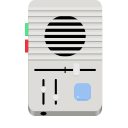
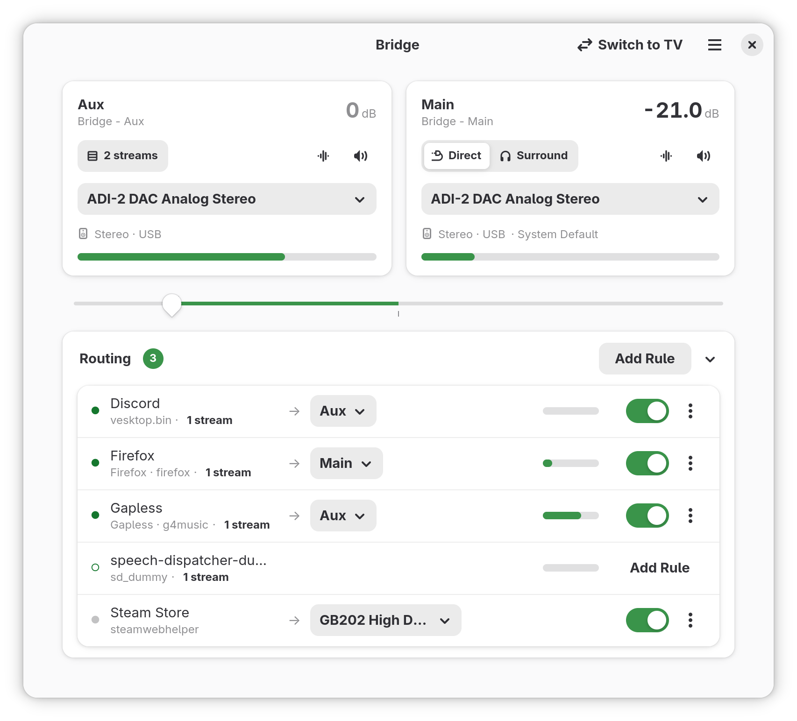

# Bridge

Route your apps to two virtual outputs and mix between them. Send chat to one side, 
your game to the other. Adjust the balance at any time.




## Features

- A crossfade mixer between two virtual outputs that your audio can be routed to
- Create pattern-matching persistent routing rules that send app audio to your desired output
- Conveniently setup headphone virtual surround by providing your own HeSuVi HRIR file
- Create output presets and switch between them at the press of a button
- Support for Global Shortcuts

## Installing

Grab the `.flatpak` from the
[releases page](https://github.com/arulan/bridge/releases), then:

```
flatpak install --user ./bridge.flatpak
```

## Building

Flatpak:

```
flatpak-builder --user --install --force-clean --install-deps-from=flathub \
    builddir io.github.arulan.Bridge.json
flatpak run io.github.arulan.Bridge
```

Build the dev manifest instead, or pass `-Dprofile=development`, to get a build that installs
alongside your normal one as `io.github.arulan.Bridge.Devel`.

Rerun `generate-cargo-sources.sh` whenever `Cargo.lock` changes. `cargo-sources.json` is committed.

Building natively requires GTK4, libadwaita, PipeWire, Meson ≥1.1, and a Rust
toolchain (edition 2024, rustc ≥1.96):

```
meson setup builddir
meson compile -C builddir
meson install -C builddir
```

## Reporting bugs

Open an issue using the bug report template. The form asks you to provide a diagnostic report
the app will generate for you. Please be detailed, include steps to reproduce, and provide screenshots
as necessary. 

## License

GPL-3.0-or-later. See [LICENSE](LICENSE).
